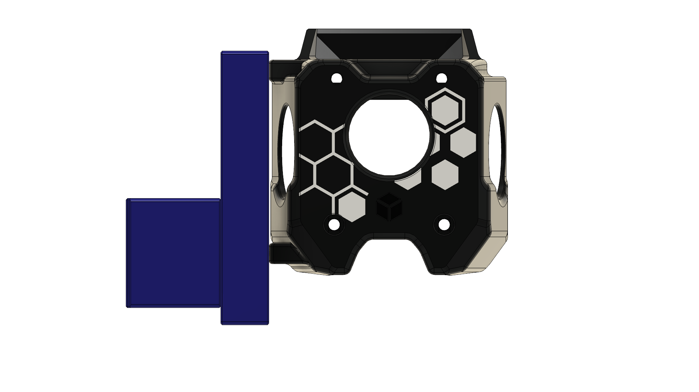
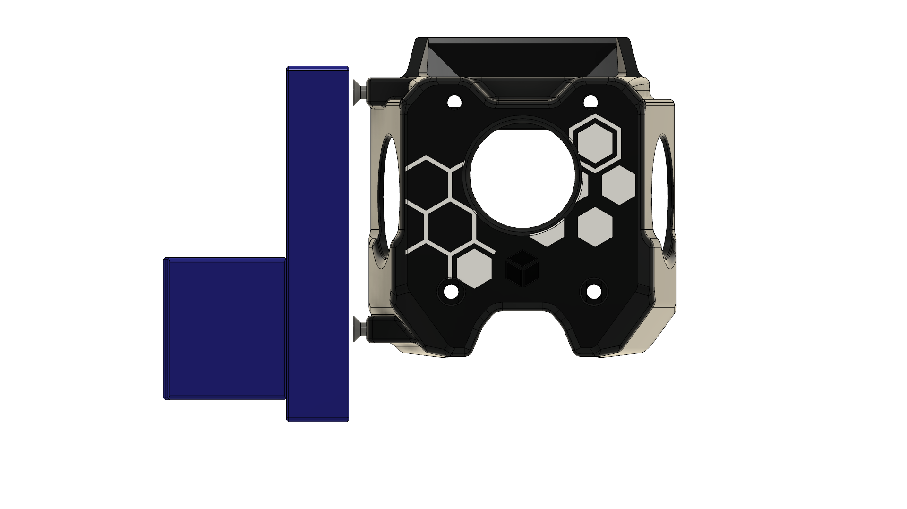
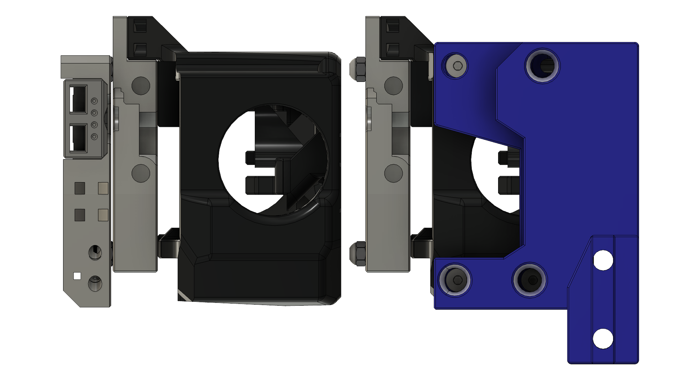
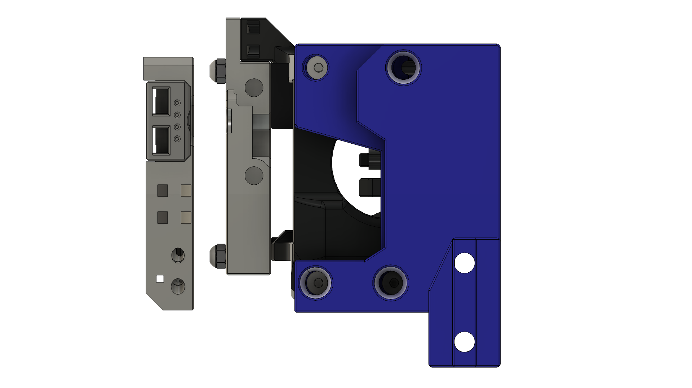
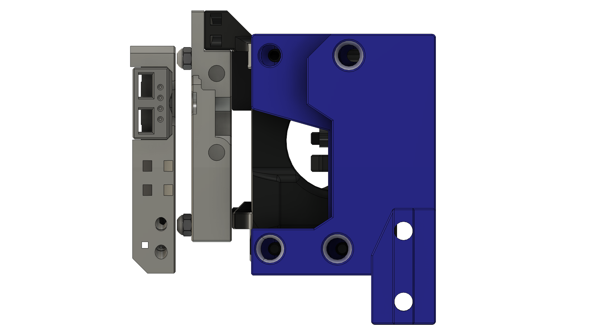
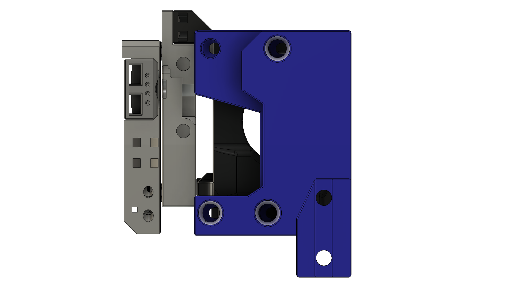

## Configuration

In this section, you'll do these steps to get up and running:
* install the `klipper-toolchanger` plugin
* copy over config chunks into toolhead-specific files
* determine and set a few critical calibration values

You should not have to invent anything here!  

You should only have to copy over a few files, then merge them with yours, and resolve the inevitable Klipper errors.

If you experience issues, check the [Troubleshooting](TROUBLESHOOTING.md) page first.

### Install `klipper-toolchanger`

* Always start from a hardware setup which has functional XYZ homing. Everything below assumes that.
 * You already tested homing, right?
* Install Viesturz’ `klipper-toolchanger`
  * SSH to your Klipper system, then install the `klipper-toolchanger` code:
```
wget -O - https://raw.githubusercontent.com/viesturz/klipper-toolchanger/main/install.sh | bash
```
  * Klipper should restart without issue.
  * To enable easy updates: add this chunk to Moonraker.conf and restart Klipper when prompted:
```
[update_manager klipper-toolchanger]
type: git_repo
channel: dev
path: ~/klipper-toolchanger
origin: https://github.com/viesturz/klipper-toolchanger.git
managed_services: klipper
primary_branch: main
install_script: install.sh
```

### Set up toolhead configs

* Look at the `Configs` folder in this repo and select a newer config to start from.
  * As of May 31 2025, r2pdx's configs are a good starting point, with better start macros.  Use that if you can.
* Copy over any missing files as you come across them.
  * Note that `klipper-toolchanger/*` are MadMax-specific sample configs for each toolhead and require a corresponding `klipper-toolchanger` dir.
* Backup your `printer.cfg` file.
* Copy over the bed mesh section below to `printer.cfg`.  If you don’t already have this section, `klipper-toolchanger` will not start. This appears to be a bug in klipper-toolchanger.
```
# klipper-toolchanger expects this section to be present.
[bed_mesh]
speed: 120
horizontal_move_z: 5
mesh_min: 2, 75
mesh_max: 118, 110
probe_count: 3, 3
```
* Modify your `printer.cfg` to reference the provided `klipper-toolchanger/` sample files, like in the sample chunk below; start with one `toolhead_*.cfg` file, and leave the rest commented out for now.
```
[include klipper-toolchanger/macros.cfg]
[include klipper-toolchanger/tool_detection.cfg]
[include klipper-toolchanger/toolchanger.cfg]
[include klipper-toolchanger/toolhead_0.cfg]
#[include klipper-toolchanger/toolhead_1.cfg]
#[include klipper-toolchanger/toolhead_1_as_primary.cfg]
[include klipper-toolchanger/homing.cfg]
```
* If you already have a toolhead-specific config file, make that file the base, and add elements from the config sample.
* Otherwise, modify and review all the added configs, making sure that every printer-specific setting is set correctly for your printer. Edit toolhead-specific files in the copied-over `klipper-toolchanger/toolhead_*.cfg `to match your printer’s pins and values, especially:
  * `canbus_uuid`
  * Extruder pins, rotation_distance, gear_ratio, and currents
  * Z/Probe pin for each toolhead; this will drive toolhead detection, so nothing will happen when you home and try to `UNSELECT_TOOL` later.
  * X endstop pin (same as Z probe), if using an endstop switch there.
  * Note that `[extruder]` in `toolhead_0.cfg` becomes `[extruder1]` in `toolhead_1.cfg`.
* (If using an endstop sensor/switch) Modify `klipper-toolchanger/homing.cfg`’s `[homing_override]` section to comment out the sensorless homing macros:
  * `#_SENSORLESS_HOME_X` → `G28 X`
  * `#_SENSORLESS_HOME_Y` → `G28 Y`
* Comment out any `[homing_override]` section you probably have in `printer.cfg`, as it will override this one, which initializes the toolchanger code.
* Enable forced moves in `printer.cfg` to support the use of `SET_KINEMATIC_POSITION`:
```
[force_move]
enable_force_move: true
```
* Restart Klipper, and resolve any errors that pop up.

### Initial Testing

* In your printer's web interface, ensure:
 * The head probe pin still shows triggered when pressed
 * Endstops still trigger when pressed (especially X endstop)
* Make sure a defined head is physically connected, as the `klipper-toolchanger` configuration assumes this! Otherwise, you get a failure to initialize the toolchanger when doing `G28` the first time after klipper restart, and then you have to restart Klipper.
* Optionally, use the probe as the virtual Z endstop, in which case, ensure a config chunk like this is present:
```
[stepper_z]
...
endstop_pin: probe:z_virtual_endstop
```
... as well as logic in `[homing_override]` (now found in `klipper-toolchanger/homing.cfg`) to move to the center and run `G28 Z`.  Verify this logic is present and make sure the G-codes in that macro are seem reasonable  and match your printer sizes.
* Home (`G28`) should succeed.  That’s a good first step.
* Verify the build hasn't changed, with `PROBE_ACCURACY`.
* Prepare for a `Z_TILT_ADJUST` or `QUAD_GANTRY_LEVEL` run:
  * Change your bed positions for `Z_TILT_ADJUST` or `QUAD_GANTRY_LEVEL` probing, as needed.
  * If you previously used Klicky or another probe with an offset, ditch any macros, as you now have a zero-offset probe.
  * A good tolerance for ZTA or QGL is 0.01 for direct-drive setups, or .0075 for geared or leadscrew-driven setups with higher Z resolution.
* Run `Z_TILT_ADJUST` or `QUAD_GANTRY_LEVEL` twice.

#### Align Docks to Frame and Toolhead
Note that everything here assumes that you’re using identical toolheads with identical builds.  

Note also that the exact alignment may depend on the dock and head choice.  For example, for V0 builds with OmniBurner, the front of the head aligns to the front of the frame, but for other builds, this may not be the case.

* Confirm toolhead-to-dock front-face alignment
  * Power off the printer and bring the head forward, near the docks, or run `M18` to disable steppers.
  * Ensure alignment of the front toolhead face about the X axis (or whatever the dock author suggests); the front face should be vertical,  parallel to the frame.
    * If there is any twist about the X axis (“head nod”), you may not get reliable toolchanging.
      * To adjust this angle, you can add a washer or shim on top or bottom.  However, increasing the magnet gap will reduce the magnetic force, so try to minimize shims, and solve the problem at the root - likely, the carriage.
* Ensure toolhead-to-dock height alignment: with the head near the dock, slide the dock up/down to get the FHCSes centered in the dock holes.  A flashlight or phone light may help.  Crank those screws now, and retighten them after a heat cycle, too.

#### Calibrate Docking Positions
Next, you'll calibrate the positions used in the docking sequence.  These values will go in the `[tool X]`  and `[toolchanger]` sections, which `klipper-toolchanger` uses to drive motion.

You want to get as close as you can to the exact docked X and Y positions.

Fortunately, 0.25mm-0.5mm accuracy is pretty easy to achieve visually.  As long as your homing position is stable (which should be the case for endstop-based homing) and nothing physically blocks the Maxwell coupling, the docking motion should be highly reliable.

The stock MadMax side dock geometry is specifically designed to be forgiving, with support for about 1mm adjustment error in any direction.

| Param Name | Type | Description | Sample Value |
| --- | --- | --- | --- |
| `params_park_x` | Per Head | Position with the toolhead aligned with the dock | 2.8 (for left head) |
| `params_detach_x` | Per Head | Position where toolhead can safely pull back in Y | 8 (for left head) |
| `params_safe_toolhead_y` | Shared | Y position where attached head can move in X and will never hit the other head | 66 |
| `params_safe_shuttle_y` | Shared | Y position with no toolhead attached, where shuttle can move in X and will not hit anything | 15 |
| `params_close_y` | Shared | Y position right before the magnets between carriage and plate start to grab, with docked head | 12 |
| `params_attach_y` | Shared | Y position aligned with center of the dock entrance, at front of docks | 3 |
| `params_fast_speed` | Shared | Speed (mm/min) of free motion; maximize this near machine limits | 20000 |
| `params_path_speed` | Shared | Speed (mm/min) of careful motion near; start low to ensure alignment is correct! | 900 |

The `params_` prefix is a signal to `klipper-toolchanger` to make these values available in toolchange macros.

Explained visually, using A4TBrick with Trident stalagmite docks:

|  |  |
| --- | --- |
| `params_park_x` (left head) | `params_detach_x` (left head) |

|  |  |  |  |
| --- | --- | --- | --- |
| `params_safe_toolhead_y` | `params_safe_shuttle_y` | `params_close_y` | `params_attach_y` |

Soon, you will set and modify these values.

The two toolhead-specific values will get added to `klipper-toolchanger/toolhead_*.cfg` files.  For example, in `toolhead_0.cfg`:
```
[tool T0]
params_park_x: 2.8 # Position with the toolhead aligned with the dock
params_detach_x: 8  # Position where toolhead can safely pull back in Y
```

The Y params are shared, and will get added to `toolchanger.cfg`; you'll change the `_y` vals first, to help with setting X values.
```
[toolchanger]
t_command_restore_axis: Z
params_safe_toolhead_y: 66  # safe motion while toolhead is present
params_safe_shuttle_y: 15  # safe motion with no toolhead present
params_close_y: 12  # Y position right before the magnets between carriage and plate start to grab
params_attach_y: 3  # Y position matching the large opening of the slots
params_fast_speed: 20000 # Go as fast as we can # Was 30000
params_path_speed: 900 # Was 1500
```

Take note and refer back here, but don't set the values just yet.  We'll get to them soon.

For the provided configs, T0 is on the left, as you look at the printer, in the minus-X direction; T1 is on the right.  

For all the params below, align visually.

##### Setup T0
* Turn the printer back on.
* Find positions: take notes, then set them in the config after.
  * Find the Y pos for the head as it aligns to the dock.
    * Note that there’s likely to be a Y shift forward after the MadMax conversion, because the core shifts brings the head forward, so your Y=0 zero point may not be physically reachable.
    * Home the head: `G28`
    * Bring the toolhead to the front left: `G0 X10 Y10`
    * …then to the left, until there is about 1mm of clearance from FHCS edge to the dock, then bring it forward until the FHCS aligns with the opening.  Try to get it within 0.5mm or even 0.25mm.  Your eyes should be accurate enough here.  A ruler pressed against the front vertical can help with alignment.
    * This value is `params_attach_y`.
  * Find the X pos for "fully attached to dock":
    * This value is `params_park_x`.
    * The edge of the toolhead shroud should be just touching the dock, or gently pressed against it.  Going 0.25 at a time tends to work well.
  * Find the X pos for "about to park in dock":
    * Find a position closer to the center where the head can safely be pulled back by the carriage, with at least 1mm of clearance between screws and the dock.
    * Since the FHCSes are typically 3mm out from the toolhead shroud, this value is typically 4mm off from params_park_x.  5mm for extra margin is harmless.
    * This value is `params_detach_x`.
  * Bring the head back into the center area of the printer. Never leave it in the front; the next home may swing right and detach the head.  Get in, get out.
    * `G0 X60 Y60`
* Set Values
  * In `toolchanger.cfg`:
    * Set the value for Y in `params_attach_y`.
    * Set the value for `params_close_y` to be much larger, before the magnets grab.
      * 10 mm beyond `params_attach_y` is a good starting point
    * Save, but don’t restart
 * In `toolhead_0.cfg`:
    * Set `params_park_x` to match the value you found.
    * Set `params_detach_x` to match the value you found
    * Save and restart.
 * Make sure T0 is still connected.
 * `G28` to initialize the toolchanger and home.
   * You should see ‘toolchanger initialized’ in the console.
 * **FIRE IN THE HOLE!!!!**
   * Test the values again, or YOLO it, with your finger hovering over the e-stop button.
   * Test detach for T0: `UNSELECT_TOOL`
   * Test reattach: `T0`
   * Test a few more cycles of this and feel proud!  Watch the alignment.  The head should snap back into the dock as the plate separates.
 * At this point, you can just print, as if nothing has changed.  T0 will stay connected if it starts that way.
 * Make sure nothing will hit T0.
   * Adjust offsets to avoid trying to print a purge line that hits stuff.
   * Bed joints and probing locations may need tweaks.

##### Setup T1
 * Repeat same steps for right head, T1
   * Find and set the values.
     * Confirm the Y position with the second head attached.
     * Find the X position for “fully attached to dock”, on the right, and use the same offset for it.
   * … then restart Klipper and try them out.
 * Test T1 switch: T1: `UNSELECT_TOOL`, `T1`

##### Setup T0/T1 Clearance
* Yes, do this for both; if one toolhead is leaning, you don’t want a mid-print collision.
* Bring T1 toward T0
  * Move T1 to the back, then move it to the left, then move it forward, getting it as close as you can to T0, in Y.
  * Take note of the value, and add a bit of margin to it, in case the toolhead is leaning backward from umbilical weight or a missing magnet or screw.
* Move T1 to the right.
  * `UNSELECT_TOOL`
  * `T0`
* Now repeat, for T0 to T1;
  * Move T0 to the back, then to the right, then move it forward, getting it as close as you can to T1, in Y.
* Save value
  * In `toolchanger.cfg`, set `params_safe_toolhead_y` `to the value you found.  Give it some clearance.
  * Save and restart.

##### Test overall reliability and speed
* Run quick attach/detach test: `DOCK_SEQUENCE REPS=10`
  * Measure dock time; Z has sub-1.3s on his MadMax T0 120, and andrewcgr has done sub-4s on a Trident 350 with advanced TMC4671 drivers.
* Consider speeding up the docking sequence before doing any reliability tests.  To speed up those tests, as well as reduce dwell time that can cause drool on prints:
  * Autotune may also be helpful, especially if set to performance, and may help with Autospeed next.
    * [https://github.com/andrewmcgr/klipper_tmc_autotune/tree/main](https://github.com/andrewmcgr/klipper_tmc_autotune/tree/main)
  * Autospeed is perfect for this, and requires only one klipper module, one line of config, and no new parts:
    * [https://github.com/Anonoei/klipper_auto_speed/blob/main/autospeed/main.py](https://github.com/Anonoei/klipper_auto_speed/blob/main/autospeed/main.py)
* Do 100 switches: `DOCK_SEQUENCE REPS=100`
* If this passes, congrats!  You’ve made a reliable toolchanger.
* Almost there!

#### Prepare for Printing
* If you haven’t already… upgrade your PSU, or at least limit maximum power to heaters as a stopgap.  Measure the power at the outlet with an inline power meter (like a Watt’s Up) if you’re not sure.
  * Zruncho says: I always watch power while making big printer changes because it can quickly catch many errors.
  * Watch out for the effects of all that extra power in a small space; at higher chamber temp, especially at V0 scale, may quickly create heat-creep or parts-getting-loose issues that weren't noticed before.
* Re-calibrate your Z offset.
  * When calibrating the z offset, note that these values must now be saved individually to the respective `toolhead_(n)).cfg` files and cannot be saved with `SAVE_CONFIG` (as that function can only write to `printer.cfg`).
  * The typical setup is to calibrate the Z offset of T0 only and use that one always for homing.  You will need to change the homing macros if you want to calibrate using another toolhead.
  * The z offset found in `printer.cfg` will still be applied as well! So either remove that, or if you will only ever home with T0, then set the z offset for each toolhead to 0 and then you can continue to simply use the value found in `printer.cfg`.
* Update ZTA or QGL probing points to a safe default, assuming both heads are present. You don't want one head to hit the other during the print start.
  * No, we don't know of a way (yet) to dynamically change the desired bed-probing points, based on the heads that are present.
* If you want to print with T0, you’re probably done with the config side.
  * Do a quick print with T0. It’s a good test.
* Note - there’s a `toolchanger_1_as_primary.cfg` file, which is similar to `toolchanger_0.cfg`, but it has T1 pretend to be Tool 0.  You can use this config file as a high-availability backup, to not have to change anything, including the slicer, if head 0 has an issue.  
  * Recommended: update the params just like T0, and do a quick print with just T1 acting as T0. Make sure to update the pin used for X homing and Z probing to the other head there.  The only change in the file is the tool number, as `klipper-toolchanger` doesn’t want just tool 1 defined.
* Do your PID tuning, EM, and PA for each new head.
  * Again, after running the calibrations you will have to manually enter the determined values into the respective `toolhead_(n).cfg`.
* Figure out offset calibration
  *  If you want to move on to a first multi-extruder print (or just print with another toolhead than the one you homed Z with), you will need to know offsets between the tools. `klipper-toolchanger` calls these `gcode_offset`s, and they must be set in `toolhead_(n).cfg`.
  * Set one toolhead (typically T0) to zero offset for all three axes.
  * Nudge is the recommended way to measure the offsets of the other toolhead(s), as noted below. However, manual offset adjustment is a second option. It will be less accurate, but can get you printing quickly.
    * Use a feeler gauge to determine the `gcode_z_offset`: adjust `z_offset` until you feel resistance, using 0.005 increments. Swap toolheads and adjust again, comparing values.
    * Alternatively, you can calibrate `z_offset` for either toolhead and then use the difference as the `gcode_z_offset`. * For X and Y there are calibration prints available: [example](https://www.printables.com/model/129617-offset-xy-dual-extruder-idex-calibration).
* Review the provided `PRINT_START`, `PRINT_END`, `PAUSE`, `RESUME`, and other custom macros, to make sure that any position values make sense for your machine.  Sample are provided in `macros.cfg`.

#### Add Nudge
* Follow instructions from the [Nudge repo](https://github.com/zruncho3d/nudge) to build, install, configure, and measure.  Get repeatability values with code from the `printer-experiments` repo if you can (more on this in the Nudge repo).
  * You don’t need to run a Nudge calibration before every print. You only need to use it when changing the tool setup (e.g. replacing a nozzle or toolhead). If you don’t have any overtravel, use one of the magnetic nudge bases to temporarily place the nudge on the printer bed.
  * In a two-toolhead system, `NUDGE_FIND_TOOL_OFFSETS` will produce a single set of values. These are the offsets for T1 relative to T0. Leave these values unconfigured in the T0 configuration, and include the values provided by nudge in the T1 configuration.
* With Nudge, you can do per-print automatic calibration now, thanks to work from beta tester `r2pdx`! See [Klipper automatic offset calibration for tool changers
](https://github.com/joseph-greiner/klipper_tc_automatic_offset_calibration).

#### Print Tests
* Put your badass toolchanger to work. Sample flexes that say, hey, you made a toolchanger:
  * Alternating-layer anything, including a Voron cube - looks trippy and cool
  * [Dual Material - torus with spiraling cross section]( https://www.printables.com/model/190844-dual-material-torus-with-spiraling-cross-section)
  * [Modifier mesh for dual color 3DBenchy](https://www.printables.com/model/908896-modifier-mesh-for-dual-color-3dbenchy)
  * [Dice - Dual Color](https://cults3d.com/en/3d-model/game/dice-dual-color)
  * [Lighthouse](https://cults3d.com/en/3d-model/art/lighthouse-buoy-ship-dual-extruder-test)
  * Tiny Panda - Rob used this one
  * Two-color tagged Voron Cube
  * MadMax poker chip - to be added