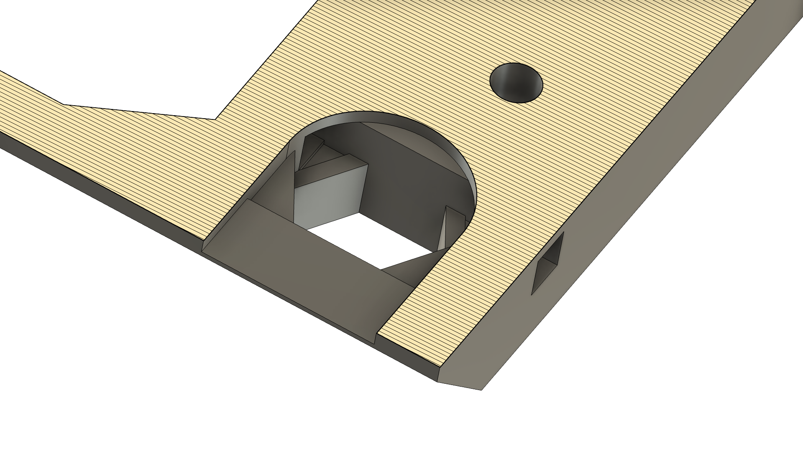
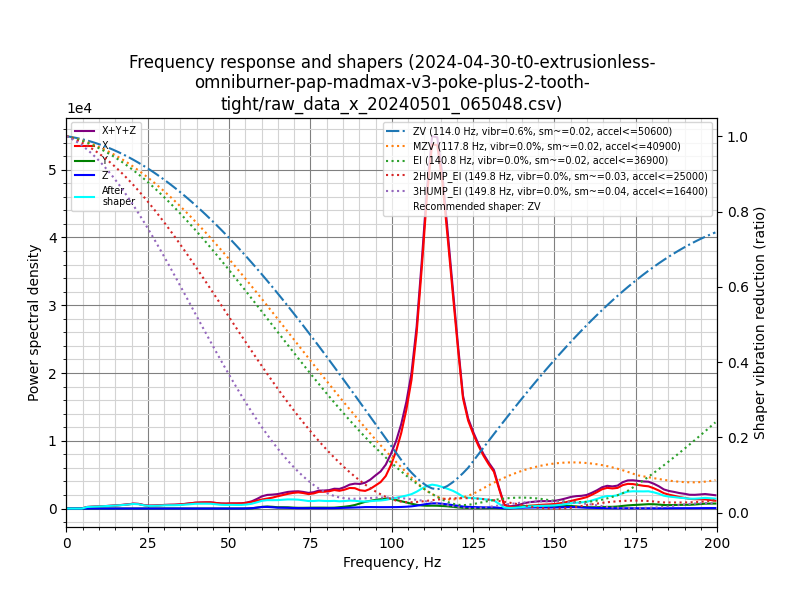
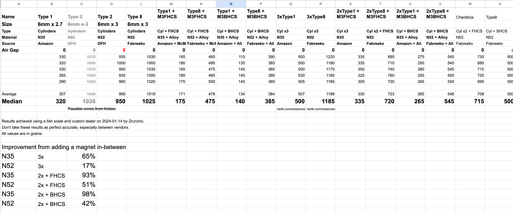
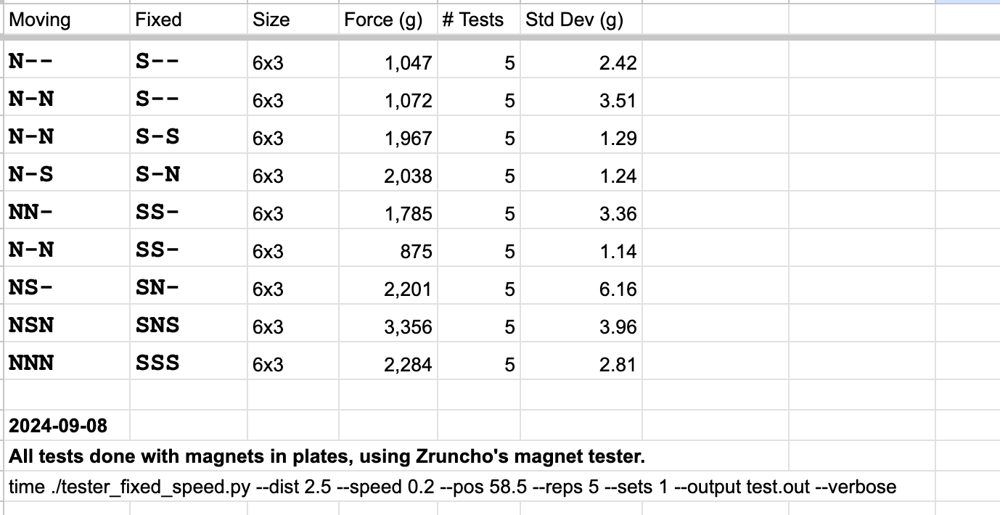
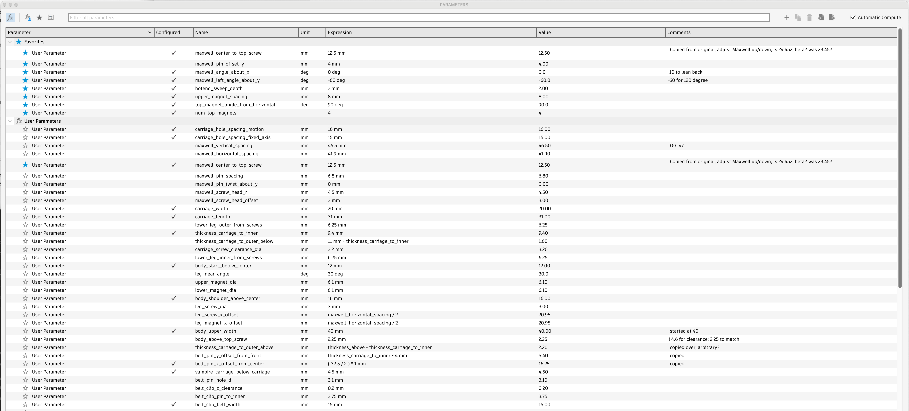
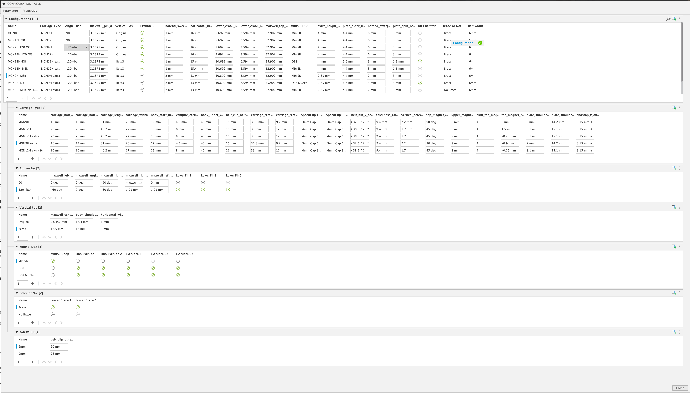

# Design

**This page tries to explain the design choices, especially the interesting ones.**

*Hopefully this section helps you understand why things are the way they are here, so you can better choose whether this project is right for you, and ideally learn a thing or two.*

No design is best, but a *good* design is one that understands what its goals and constraints are - then, achieves them under-budget, while delivering a good experience for the target audience.

**The audience for MadMax is NOT everyone.**  We're just not there yet.

It’s for leading edge, tip-of-the-spear types.

But, no single step is hard! If you can build and configure a Voron, you can do the MadMax steps too.

What we’ve tried to achieve here is *not* to fit every toolhead or printer, but to be the simplest on-ramp to adding a second toolhead possible, and fit most toolheads and printers with a single common design, so that ports happen from the community.

First, goals, requirements, metrics, and non-goals; without these explicitly defined, it can be harder to wrangle a project like this towards a release, even with one main developer.

## Goals
* Enable high-quality multi-toolhead printing, for as many printers as possible, at reasonable price

## Requirements

“Must be:” stuff:
* **Easily sourced**: ideally all COTS stuff; no rail grinding or cutting, minimal electronics per head, if possible
* **Safe**: crash detection is critical
* **Prints well**: with no ringing, and good resonance testing
* **Tolerant to misalignment**: ideally at least 0.5mm of alignment inaccuracy allowed in all dimensions, and ideally beyond
* **Performs**: ideally “weight neutral” or no more than 10% added head weight relative to other options
* **Versatile**: support a wide range of printers, with as much available travel as possible
* **Fast to convert**: minimize wiring changes needed; ideally, sub-1 hr

## Metrics

“Optimize for:” stuff:
* Cost: $100ish, or as low as possible, for the MadMax-specific parts and second head
* Fast toolchanges: sub-second (!) target, but 4s is plenty fast, in practice
* Minimize design work
  * Ideally, enable multiple unchanged or minimally changed toolheads from the V0 ecosystem.
* Ideally, conversion possible without having to reprint the first toolhead
* Ideally, enable multiple non-V0-ecosystem toolheads, too

## Not goals
* Any particular wiring layout; second umbilical for the shuttle is OK (for now) - maybe simplifies some startup firmware
* Support for full-size Voron toolheads - but, it happened anyway from Beta members :-)
* Initial support for more than two heads - but, nothing precludes this

## Choices

For the design that emerged.. below are some interesting parts/choices/features/attributes, and discussion around them.  Yes, it’s a lot.

#### No glue, no tape, no epoxy: mechanical fastening only
This isn’t trivial!   

You have to get the dimensions right to do press fits, like those used by the magnets, when every printer is slightly different.

We tried different sizes and magnet shapes, with a press fit, and a survey of builders.  How do you even do press fits when you want to use cylindrical magnets?  You test and find a happy medium.

In one early test in a hot chamber a magnet escaped, which motivated the magnet-retention screws, which use the tip of a screw to retain the magnet.

#### Reliable metal connections with no special parts
“Metal sandwich construction” is used for carriage wires, plus crimp terminals on the plate.

Originally we had set screws from the side, using formed threads.  It worked, but not for long, in a heated chamber.  Plastic deforms over time, loosening the connection, and the set screw could easily strip when tightened, too.  

Then we moved to screws squeezing wires, but the connections would get loose due to plastic creep.

Heat cycles cause expansion and contraction, and then the screws loosen, and the electrical connection becomes flaky.  I’d see this after just a few print cycles!  You could tighten the screws, but the flaky connection would come back eventually. It’s a fundamental deficiency; the metal expands more than the plastic, so inevitably it gets loose.

Now, layer lines are all aligned, and screws are in compression; you can’t split the layers by forming the threads.  There are no formed threads in the parts anymore, anyway.

What we have on the plate part (which sees the most heat) is solid: metal (ring terminal) touches metal (heaetset).

The carriage has it a bit easier for now, heat-wise, and seems OK after an initial retightening.  This would be an area to improve.

#### Easy Printing w/no supports needed and no overhangs, just small bridges

The 4-layer bridges on the carriage are the most complex bridges I’ve ever done.  They're not hard to make; they just take time to ensure clean prints.  The plate, near the crimp cutouts, also has some complex bridge work.  Here's an example:

#### CoM/CoF alignment

This was a huge change, to shift the toolhead to just about the lowest possible, without removing the MiniSB as a possible toolhead option.

By aligning the center of mass of the toolhead to the center of force of the carriage, you reduce toolhead-nod effects that show up on Y-motion resonance tests, as the head rotates about the X axis.

IS graphs are pretty decent in MadMax, and IS effects appear to come from toolhead choice and its weight distribution, more than the use of the MadMax core.

Here's 2 examples from an earlier version, before improvements:

|  |  |
| --- | --- |

#### Clean airflow
Also part of beta2→beta3 and many other related changes.

Multiple issues arise when hotend airflow is blocked: hotend clogs become possible for cooling-deficient hotends like Dragon HF, but also components nearby heat up more and get softer, causing screws to loosen.  We're trying not to require exotic filaments for a long-term functional design here.

Shifting the head downwards enabled a much more unrestricted path for hotend air.

#### Pins + Screws Maxwell coupling
This is the core of the project and received the most attention and testing.

120 degree vs 90 degree is not an obvious choice.  Prusa XL and Daksh use 90 degree, as it's easier to machine and design.  We kept both and compared them with beta2, but couldn’t see any difference with data.  120 is symmetric and enables easier connection and tighter packaging, so it became the default.

Note that CAD supports a twist about X too, so that you can preload the Maxwell coupling against gravity somewhat, but I wasn’t sure how to make use of that on the plate side.

The coupling uses BHCSes, not acorn nuts; acorn nuts can flake and deform with the thin chrome upper.  However, typically steel BHCSes can wear over many cycles, so we use grease and encourage periodic replacement, until a harder BHCS surface can be found, or slipperier-yet-still-conductive pin material can be found (like bearing bronze, IF it were available in 1/8 or 3mm diameter).

#### “The probe is the coupling, and more”

Having a coupling that enables a probe and does head detection too, is not new; Z-motion designs like TapChanger, Stealthchanger, and ClickChanger do this.  I like that you get so many additional functions from one simple circuit: probing, toolhead detection, crash detection, and potentially even as an endstop too.

#### As large as possible, but no larger, for the coupling
The coupling can’t really go larger, without major changes; the MiniSB third hole and two front holes, combined with wanting the space to screw to bottom of the cowling on both DB8 and MSB, is what drives the dimensions.  

One can absolutely go taller and wider for more stability, if you change those assumptions, but this width seems OK for now.  Yes, it's strictly better to go wider and taller, and you can imagine a more Stealthburner-size-optimized design which isn't encumbered by the choice to support the MiniSB mounting pattern.

#### Off-the-shelf magnets, informed by lots of data
M selection is critical.  
* You want a solid hold, but not so solid that the gantry skips steps when pulling away.
* You also them reasonably sourceable, worldwide.
* You want a size and amount that don't require a larger or heavier setup.

The [Story](STORY.md) page gives more details about the magnet tester and friction tests, and even before automating the testing, a fish scale and simple manual tester provided some great data: [Magnet Testing Gsheet](https://docs.google.com/spreadsheets/d/1X4UAiYmL6JsJxDt9J2394Aaxse2pJNTfiht_ZRcQ6PA/edit?gid=0#gid=0).

Here's a tiny subset of magnet-force testing:

I tried out combos of magnet materials, sizes, orientations, numbers (up to 3 stacked) and even combos of magnets and screws.  

The orientations affect things more than you might expect!

The end choice was 6mm Neodynium magnets, as they are strong (about 1kg per magnet), are sourceable from multiple locations, small enough, and don't lose too much force at reasonable chamber temps.

A magnet plus a ferrous screw would give more design flexibility, with good hold, but not quite as much.  If you're designing something like this, consider that option.

You do need some air gap that necessarily reduces the magnet force, and some of the force is "lost" to just holding the head up.  Four main magnets is about right and gives some margin to hold up heavier toolheads.

The lower two magnets are not strictly needed, but help provide stability against shaking.

#### Careful hole sizes for improved stability
Voron design guidelines are a great start, in general.  

For example, clearance holes should be 3.3mm, because printers vary and because inner perimeters tend to come out about 0.15-0.2mm smaller than intended.  

However, we want tight fits and minimal motion.  Some screw holes are "twist until it strips" style, which ensures that there's almost no clearance.  An example is the top Maxwell screw.  This is critical for probing, so you really don't want any designed-in slop there.

#### Parametric CAD
Parametric CAD is work, but can totally be worth it, especially when the overall layout of a file has stabilized.  There were about 3 complete redos of the CAD here.  When every little change is painful, because your sketches have dependencies, or so many constraints that Fusion fails to compute them, you may just want to bite the bullet and do a redo.

Here's a tiny subset of the parameters!  Even when a parameter isn't likely to change, it still gives you a way to document some knowledge, so you can refer back to it later.

That's less than 1/3 of the params in use.  It seems excessive, until you compare it to the alternative: not having a way to search for values by name.

HOWEVER, that's the easy part.  The challenge in making a design "properly parametric" is that any shape that varies with a choice - and everything that depends on it - must work when potentially many params change size.  You have to reason about the parameters, and you have to test every change on all the variants.   Speaking of which...

#### Configured Fusion360 CAD
Fusion Configurations helps a ton with a design like the MadMax core that wants to support distinct versions.  Each variant becomes explicit, and much easier to select, so that when you make one change you can confirm quickly, on all designs, that you haven't broken anything else.  You can just force a value for a variant, vs having to make everything an equation - which might not be possible.

You also get to make design features dependent on a config, which is really handy; a design may only need a cutout at a certain size, for example.  When you combine an already-parameteric design with Configurations, you can add new sizes quickly and without too much pain.  An example: the 9mm belt config was pretty reasonable - about an hour, if I recall.

Here's what the Configurations screen looks like:

Yes, it fills up most of a 27" monitor's width.  Many of the top rows are for variants that aren't released, but that's a benefit!  You can track prior versions in one file.  These need to be cleaned up at some point, but you can leave them in until fixed.

#### Reliability Testing
Some of the first tests were aggressive reliability tests for the critical core coupling.  

In fact, a successful 10K-cycle was the trigger for opening up the project to beta testers!

#### Actual print testing is king!

However, the most realistic testing is in the most realistic environment - in printers, especially hot chambers.  We've been doing this testing for over a year, and it's driven all the major changes, mostly around removing the potential for electrical connections loosening over time.

There was one attachment failure from magnet pullout; that required a rethink of magnet positioning.

So far, so good, with two caveats:
* The metal FHCSes on the head will likely cause plastic wear on the docks.  That's expected.  Watch out for it, and if possible, consider higher-wear plastics, periodic replacement, or gentler detach speeds.
* After many cycles of probing, the metal BHCS heads seem to wear in a way that affect probing repetability.  If you're getting jumps while doing probing of 0.1mm or so, this is a sign.  There's lots more which could be the cause, but in some cases, replacing the screws seems to magically restore the coupling back to triple-zero probing.  Perhaps you have some ideas for surface-treating the BHCSes to improve longevity, using a better grease, or changing to a material like titanium there.  Given that replacing the 2 screws takes a minute and pennies not dollars, I decided to move to release with this caveat.  Plus, if you use Beacon or similar, there's minimal use of the coupling to do probing, so you won't care about it.

#### Spinoffs aplenty
Lots of projects came out of this one, or at least were spurred on by it, as intermediate milestones, or more-broadly-useful projects of their own.  Nudge, Vampire Bat, SpeedClips, a magnet tester, plus a bunch of toolhead mods like DragonBrick, OmniBrick, A4TBrick, and more, including r2pdx's per-print offset-calibration macros.

If you're spinning things off all the time, that's a good thing!  