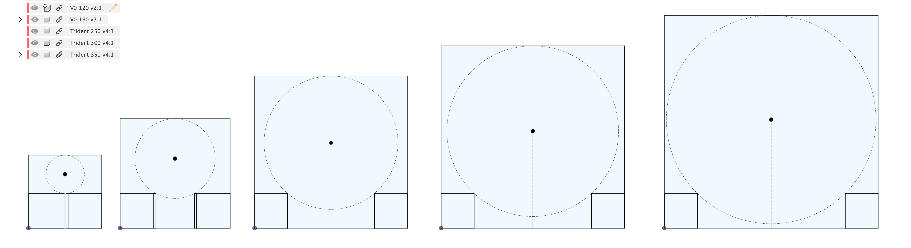

### High-level comparisons

Q: How does this compare to other toolchanger options?

A: The main way this is unique is that the kinematic coupling uses XY motion only, and does not have a positive lock.  For comparisons to other open-source projects, keep reading.

Q: How is this different from TapChanger/Stealthchanger/MISSChanger?

A: These are key ways:
* Static gantry support, so you don’t need a flying gantry printer OR to make a liftbar, which reduces complexity.
  *	This attribute enables many printers to get a toolchanger addition: Trident, Salad Fork, V0, T0, etc.
 * As a result, toolchanges are faster, without having to go to 48V or do any optimization, because there’s no Z motion needed.
* The attachment mechanism differs; it doesn’t have a positive lock, only magnetic.
* The stock docks are different, and don't need Z motion; each toolhead has screws that mate to the docks.

Q: How is this different from Daksh?

A: Both are similar, in that they share the XY-only motion, but MadMax only has a magnetic coupling, vs a positive lock with a rolling pin for Daksh.  As a result, Daksh (like the Prusa XL on which its toolchanger mechanism derives) can withstand higher forces on the head, before a detach occurs.

Q: Why not just use an IDEX?

A: With an IDEX, you need at least one extra motor driver and Y moves are necessarily slower, since you have two toolheads’ worth of inertia to overcome.  

On any typical CoreXY printer, Y moves are harder than X moves, because the full X gantry weight must be overcome, which makes Y moves the input shaper bottleneck.  Making the bottleneck even worse is Generally Bad, and in this case, since Klipper only has a single combined X and Y axis max acceleration parameter, the whole machine is then likely to run slower as a result.

There’s also a second head stuck there when you don’t want it, which requires a larger frame or reduces travel, and makes a conversion harder; you rarely see stock-square printers with IDEX conversions, because you have no way to get that space back, even if all you want is a single-extruder print.

Q: Why not just use a Dual Gantry if you’re going to have two heads?

A: In comparison to dual gantry, a toolchanger can be an easier conversion, uses more off-the-shelf mods, is lower cost, uses any printer, has easier maintenance, results lower complexity, can use stock Klipper kins, … the list goes on.  That said, DG avoids the complexity/risk of a kinematic coupling, and has more toolhead choice as a result.
You can even mix the two, and try out MadMax in-place, on your D0.  Zruncho’s done this crazy thing - putting a toolchanger inside a deal gantry printer.  It’s all reversible and easily installed.  You can even keep all the wiring in place.

Q: Why not just use a magnetic IDEX here?

A: “Magnetic IDEX” - more accurately named Shared-Axis Toolchanger (SATC) - is a toolchanger, but with a shared axis, so you still incur the weight penalty of the second head on Y moves, yielding inferior print quality or slower speeds for the same quality. You also are limited to two heads.  But compared to regular IDEX, you lose the extra motors, motor drivers, and design work, which is a win.

Q: What toolheads can I use with MadMax?

A: Anything compatible with the toolhead plate choices. See the [Getting Started](GETTING_STARTED.md) guide.

To attach to the docks, your toolhead needs to have the holes for the FHCSes already in place, or you can use a template to add those holes in, “in post”.

### Printable Space and Number of Heads
Q: How much print space do I lose?

A: It depends on the type of print and whether you make adjustments to enable a fixed Nudge mount.
The below assumes that the bed is close to the size of the printable XY space, and that we have a static-gantry printer or docks-ride-with-gantry flying-gantry printer.

* For single-extruder prints - assuming you detach the unused second head:
 * X
   * No loss, if your printer already has 3mm of X overtravel on one side.
   * 3mm X loss on one side, if no overtravel, but only at the front area by the dock.
 * Y
   * None, if you use a non-fixed Nudge mount (floating or indexed).
   * 6mm+ Y if you use a fixed Nudge mount and square bed; typically the front or back will be reserved for probing, and a bed shift may be needed.
 * Z
   * None, if you use a non-fixed Nudge mount.
   * Some, if you use a Nudge mount that requires the bed to be raised and you don’t already have Z overtravel available.
* For two-extruder prints
 * The lost space is typically the two front corners; for narrow printers like a V0, that front area becomes narrow, and usable only for prime lines.
 * X:
   * Depends on toolhead choice:
   * On each side - width of head + X-stick-out of screws (3mm) + clearance (1-2mm)
 * Y:
   * Y-dock-sliding-motion (~6mm) + Y-screw-stick-out-from-plate (4mm) + max Y depth of toolhead (varies)
 * Z
   * Same as single-extruder
Alternately, you can eliminate travel loss for two-extruder prints by:
* going wide (X widening equal to double the toolhead width in X, just like an IDEX)
* going deep (Y lengthening equal to the dock travel + screw stick-out + toolhead length in Y
* going tall (like a TapChanger/StealthChanger build, but only for flying-gantry printers)

Q: How many heads can I fit?

A: Depends on the printer of course, but also on available overtravel, as well as whether you want to do front or rear probing.  If doing front probing, you’ll need to reserve space for the probing motion, which would be the head width in X, plus the travel needed for Nudge (6mm+), plus a bit of clearance (1-2mm).

### Design Questions

Q: What unknowns remain in the design?

A: For full disclosure, we don’t know everything about it.  Early dev started in later 2023, but there are still some “how well does it work in practice?” questions.
* Whether the magnet hold is sufficient for superhigh accels and heavy toolheads, especially at elevated chamber temps.  So far, so good, even with crazy accels on Andrewmcgr's TMC4671-based Trident.
* Pull on the belts from attach/detach triggers viscoelastic hysteresis effects that may create errors within a print, over time.  Has not been quantified, but does not appear to be significant in prints.
* Whether Maxwell probing accuracy and Nudge alignment accuracy retains with higher chamber temps, and over time.
* IS effects, over a larger range of toolheads and printers.  Your before-and-after data is highly valuable here.
* Toolhead coupling wear.  So far, so good, especially with acetal.  PTFE shows visible wear, too quickly.  It's too soft.

### Why not < X >?

Q: Why no Boop here?

A: Boop’s great, but adds weight and force and design complexity.  We already have a Maxwell coupling.  Why not use it?  It will do triple-zero repeatability, despite being based on sliding friction.

Failing that, you can use your preferred low-force probing mechanism, whether Klicky-ish, Beacon, or other.

Higher-force mechanisms (Poke, Peck, Metal Peck) are not recommended yet, as you’re combining two springs at that point.

Q: Why not use the PrusaXL/Daksh latch mechanism for positive attachment?

A: It’s a great mechanism that uses rolling friction and has a solid mechanical lock.   It will scale better to heavier toolheads. But it also adds weight and a non-COTS part.
Magnets are, surprisingly, good enough here.  Overall simplicity and portability was a goal here.

Q: Why V0 support?

A: A V0 toolchanger is an affordable dev platform.  You can even just make the gantry to play with, maybe from spare parts, to learn and test the software side.

You don’t *need* to expand the frame, because you can easily detach a head and have something almost identical to a typical V0, just with an easier-to-maintain toolhead.  That’s a sweet V0.  It adds capabilities, in the same space.

Plus, you can expand the frame anyway, easily, as done with Tri-Zero plus.  A Plus-size V0 is a killer V0.  Multi material and more build space!  Just add frame extensions, large panels, and longer rails and belts.  It’s a small delta to a kit and you can use the shorter rails with T0.

But all that said - yeah, it’s not the best choice because of the inherent Y loss from the second head.  Larger just makes more sense here if you care about the usable workspace for two-extruder parts.

Q: Why aren’t there MiniSBs in use by default?  Can I reuse mine?

A: Simple - you can’t fit two MiniSBs (57mm width) in a normal V0 and have space for mechanical automatic alignment from a Nudge probe in the front.  Also, given that there are now many more choices that give extruder flexibility and easier maintenance, others are gaining traction.  OmniBrick, DragonBurner, and DragonBrick solve that.
Some notes about this:
* On a smaller build, a camera + Z probe per head would almost solve the space issue: 114 + 57 —> 171... but it’d be really tight unless you have extra overtravel from a Pandora X gantry.
* Z prefers the maintenance ease of a toolhead that has a detachable extruder, and loves that the PapLite can handle anything with high quality, in a tight package - especially abrasives (like CF-ABS), without killing the drive gear.
* OmniBrick and DragonBrick fit the toolhead board in front, which gives more usable Y travel.  Remember, when the active head is moving, it has to keep clear of the parked heads.  A deeper-in-Y head results in loss of usable Y here, and we’re already tight; the MiniSB does not leave space for a front toolhead.

Q: Why not add a fridge door?

A:
* Go ahead!  It makes everything easier.  You can then mount Nudge to the front extrusion and can fit a larger 130x130 MRW bed in place.
* If you do this, you may want to shift the docks forward slightly to make use of the extra travel.